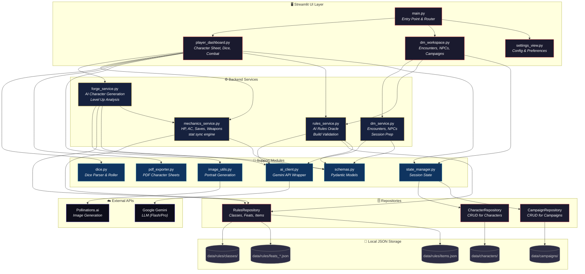

# 🩸 Phyrexian Forge
> *"All will be one."*

**Phyrexian Forge** is a premium, AI-powered specialized tool for **Dungeons & Dragons (5e & 5.5e)**. It serves as a bio-mechanical forge for character creation, strategic optimization, and campaign management, powered by Google's Gemini LLM.

---

## ✨ Features

### 🗡️ For the Player
- **AI Character Forge:** Generate fully equipped, thematic heroes from a simple text concept.
- **🖼️ Dynamic Portrait Generation:** Automatically generated, high-quality character portraits based on your hero's race, class, alignment, and backstory (powered by Pollinations.ai).
- **🎲 Interactive Dice Roller:** Integrated dice mechanics with support for automated attack and damage rolls using your character's real-time modifiers.
- **📖 AI Playstyle Guide:** On-demand generation of a comprehensive strategic guide (Combat & Roleplay) tailored to your specific build and level.
- **Dual Edition Support (5.5e Ready):** Seamlessly toggle between **D&D 2014** and **2024 Revision (5.5e)** rulesets.
- **Character Vault:** Manage, view, and persist your characters with deep integration for stats, alignment, and features.
- **Premium PDF Export:** Export your character to a standard 5e fillable PDF, featuring automated proficiency marks and character portraits.

### 🏰 For the Dungeon Master
- **DM Quick Forge:** Rapidly generate NPCs and monsters to populate your world.
- **Campaign Workspace:** Track session logs, plot hooks, and active campaign developments with AI assistance.
- **Party Tracking & Initiative:** Monitor the entire party's stats from a centralized dashboard and track combat turns with a built-in initiative system.
- **Static Rules Engine:** Level-up features and class/feat lookups are powered by a rigorous, local JSON knowledge base (for both 2014 & 2024 rulesets) to guarantee perfectly accurate progression without AI hallucinations.

---

## 🎨 Aesthetics & UI
- **Bio-mechanical Design:** High-contrast dark theme with a custom Phyrexian aesthetic.
- **Segmented Control Navigation:** Modern, pill-shaped navigation for a faster, premium workflow.
- **Custom AI Logo:** Iconic Cyber-D20 branding integrated with Phyrexian lore.

---

## 🛠️ Tech Stack
- **Dependency Management:** [Poetry](https://python-poetry.org/)
- **Frontend:** [Streamlit](https://streamlit.io/) (Styled with Custom CSS & Segmented Controls)
- **AI Engine:** [Google GenAI SDK](https://pypi.org/project/google-genai/) (Gemini Flash/Pro models)
- **Image Generation:** [Pollinations.ai](https://pollinations.ai/)
- **Data Architecture:** Repository Pattern (`CharacterRepository`, `RulesRepository`) handling static JSON local storage.
- **PDF Engine:** `pypdf`, `reportlab`
- **Quality Control:** `pre-commit`, `ruff`

---

## 🏗️ Architecture



---

## 🚀 Getting Started

### 1. Prerequisites
- **Python 3.13+**
- **Poetry**
- **Google Gemini API Key** (Available at [Google AI Studio](https://aistudio.google.com/))

### 2. Installation
```bash
git clone https://github.com/dimitrisl/agents.git
cd agents
poetry install
```

### 3. Environment Setup
Copy `.env_example` to `.env` and add your `GEMINI_API_KEY`.

### 4. Run
```bash
poetry run streamlit run main.py
```

---

## 🧪 Development
- **Tests:** `poetry run pytest tests/ -v`
- **Pre-commit Hooks:** `poetry run pre-commit install`
- **Linting & Formatting:** `poetry run pre-commit run --all-files`
