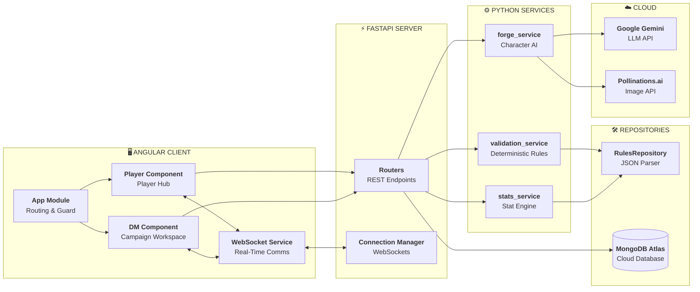

# 🩸 Phyrexian Forge
> *"All will be one."*

**Phyrexian Forge** is a premium, AI-powered specialized tool for **Dungeons & Dragons (5e & 5.5e)**. It serves as a bio-mechanical forge for character creation, strategic optimization, and campaign management, powered by Google's Gemini LLM.

---

## ✨ Features

### 🗡️ For the Player
- **🧙‍♂️ Wizard-Themed Onboarding:** A beautiful, branching landing page with a sequential, animated "Wizard's Journey" tutorial to guide new adventurers.
- **AI Character Forge:** Generate fully equipped, thematic heroes from a simple text concept.
- **🖼️ Dynamic Portrait Generation:** Automatically generated, high-quality character portraits based on your hero's race, class, alignment, and backstory (powered by Pollinations.ai). Portraits can be updated at any time in Edit Mode.
- **🎲 Interactive Dice Roller:** Integrated dice mechanics with support for automated attack and damage rolls using your character's real-time modifiers.
- **📖 AI Playstyle Guide:** On-demand generation of a comprehensive strategic guide (Combat & Roleplay) tailored to your specific build and level.
- **Dual Edition Support (5.5e Ready):** Seamlessly toggle between **D&D 2014** and **2024 Revision (5.5e)** rulesets.
- **Character Vault:** Manage, view, and persist your characters with deep integration for stats, alignment, and features.
- **Premium PDF Export:** Export your character to a standard 5e fillable PDF, featuring automated proficiency marks and character portraits.

### 🏰 For the Dungeon Master
- **DM Quick Forge:** Rapidly generate NPCs and monsters to populate your world.
- **Campaign Workspace:** Track session logs, plot hooks, and active campaign developments with AI assistance.
- **Party Tracking & Initiative:** Monitor the entire party's stats from a centralized dashboard and track combat turns with a built-in initiative system.
- **Real-Time WebSockets:** Whisper messages privately to players or request skill checks directly to their screens.
- **Static Rules Engine:** Level-up features and class/feat lookups are powered by a rigorous, local JSON knowledge base (for both 2014 & 2024 rulesets) to guarantee perfectly accurate progression without AI hallucinations.

---

## 🎨 Aesthetics & UI
- **Bio-mechanical Design:** High-contrast dark theme with a custom Phyrexian aesthetic using Angular and CSS custom properties.
- **Responsive Architecture:** Fully responsive grid layouts accommodating mobile and desktop play styles.
- **Real-Time Toasts:** Roll toasts pop up instantly using WebSocket subscriptions to keep the whole party engaged.

---

## 🛠️ Tech Stack
- **Frontend:** [Angular 19](https://angular.dev/) (RxJS, Signals, Standalone Components)
- **Backend:** [FastAPI](https://fastapi.tiangolo.com/) (Python 3.13)
- **Dependency Management:** [Poetry](https://python-poetry.org/)
- **AI Engine:** [Google GenAI SDK](https://pypi.org/project/google-genai/) (Gemini Flash/Pro models)
- **Image Generation:** [Pollinations.ai](https://pollinations.ai/)
- **Data Architecture:** MongoDB Atlas (Characters & Campaigns), local JSON (Static Rulesets).
- **PDF Engine:** `pypdf`, `reportlab`

---

## 🏗️ Architecture


```mermaid
graph LR
    %% Layer 1: Client (Angular)
    subgraph CLIENT ["🖥️ ANGULAR CLIENT"]
        direction TB
        APP["<b>App Module</b><br/>Routing & Guard"]
        PD["<b>Player Component</b><br/>Player Hub"]
        DM["<b>DM Component</b><br/>Campaign Workspace"]
        WS_CLIENT["<b>WebSocket Service</b><br/>Real-Time Comms"]
    end

    %% Layer 2: API (FastAPI)
    subgraph API ["⚡ FASTAPI SERVER"]
        direction TB
        ROUTERS["<b>Routers</b><br/>REST Endpoints"]
        WS_SERVER["<b>Connection Manager</b><br/>WebSockets"]
    end

    %% Layer 3: Services
    subgraph SERVICES ["⚙️ PYTHON SERVICES"]
        direction TB
        FORGE["<b>forge_service</b><br/>Character AI"]
        VALIDATION["<b>validation_service</b><br/>Deterministic Rules"]
        MECH["<b>stats_service</b><br/>Stat Engine"]
    end

    %% Layer 4: Infrastructure & Data
    subgraph INFRA ["🛠️ REPOSITORIES"]
        direction TB
        RULES_REPO["<b>RulesRepository</b><br/>JSON Parser"]
        DB[("<b>MongoDB Atlas</b><br/>Cloud Database")]
    end

    %% Layer 5: External
    subgraph EXTERNAL ["☁️ CLOUD"]
        GEMINI["<b>Google Gemini</b><br/>LLM API"]
        POLL["<b>Pollinations.ai</b><br/>Image API"]
    end

    %% Flow
    APP --> PD & DM
    PD & DM --> ROUTERS
    PD & DM <--> WS_CLIENT
    WS_CLIENT <--> WS_SERVER
    ROUTERS --> FORGE & VALIDATION & MECH
    FORGE --> GEMINI & POLL
    VALIDATION & MECH --> RULES_REPO
    ROUTERS --> DB
```

---

## 🚀 Getting Started

### 1. Prerequisites
- **Python 3.13+** and **Poetry**
- **Node.js 18+** and **npm**
- **Google Gemini API Key** (Available at [Google AI Studio](https://aistudio.google.com/))
- **MongoDB Atlas URI** (Add as `MONGO_URI` in `.env`)

### 2. Installation
```bash
git clone https://github.com/dimitrisl/agents.git
cd agents

# Install backend dependencies
poetry install

# Install frontend dependencies
cd client
npm install
cd ..
```

### 3. Environment Setup
Copy `.env_example` to `.env` and add your `GEMINI_API_KEY` and `MONGO_URI`.

### 4. Run the Application
You can use the provided bash script which automatically starts both servers:
```bash
./start.sh
```
Alternatively, to run manually:
```bash
# Terminal 1: Backend
poetry run uvicorn server.main:app --reload --port 8000

# Terminal 2: Frontend
cd client
npm start
```
The application will be available at `http://localhost:4200/`.

---

## 🧪 Development
- **Backend Tests:** `poetry run pytest tests/ -v`
- **Frontend Tests:** `cd client && npm test`
- **Quality Control:** Ensure all logic respects the deterministic static `data/rules` directory. No domain knowledge should be hard-coded into the python files.
